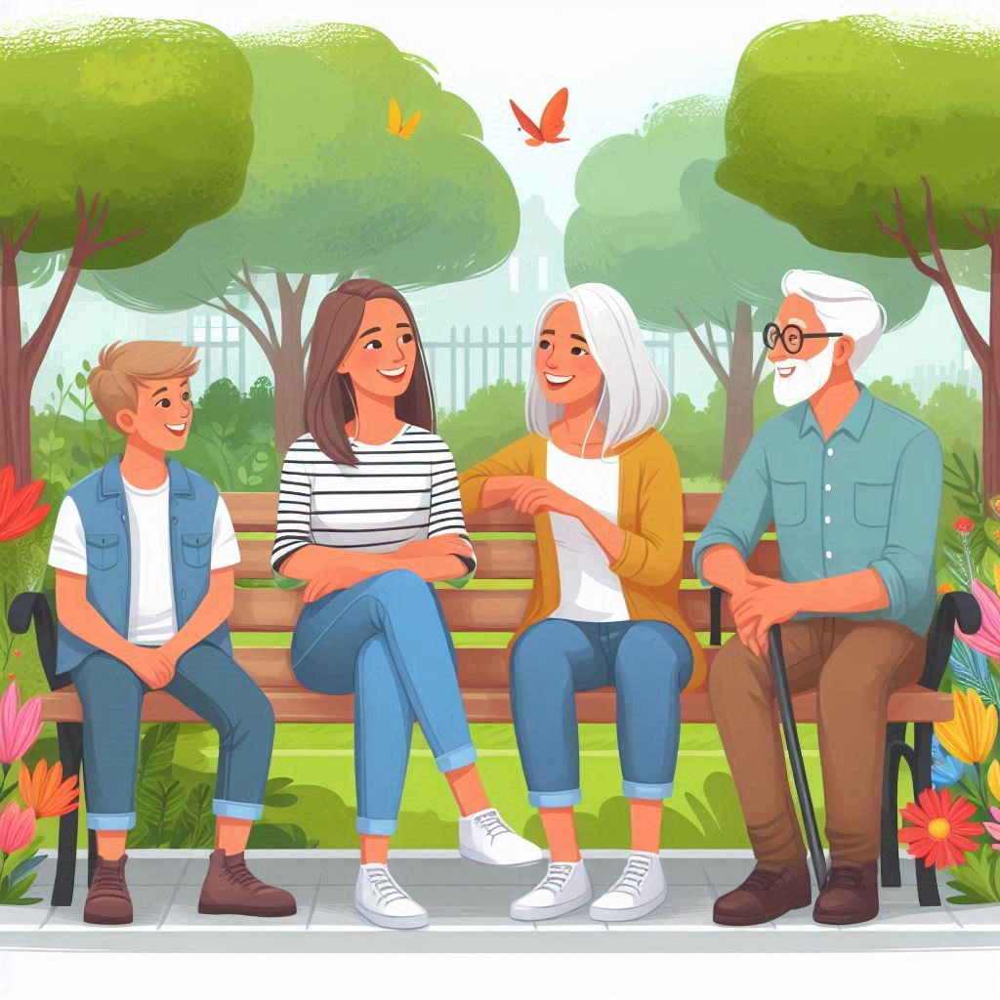
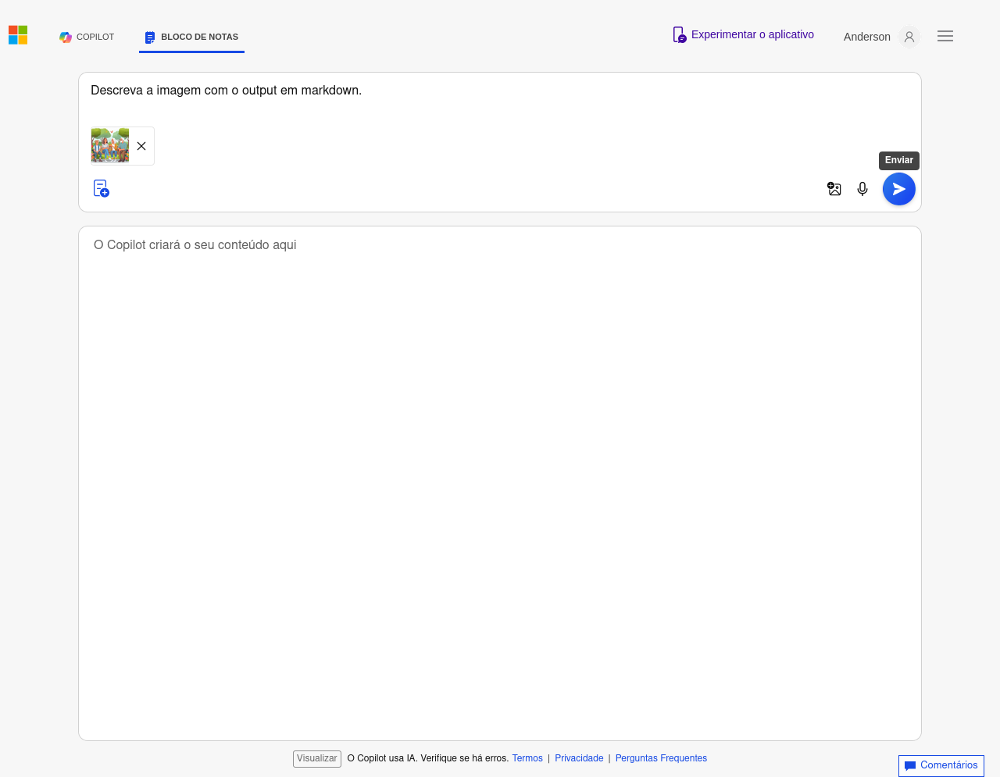
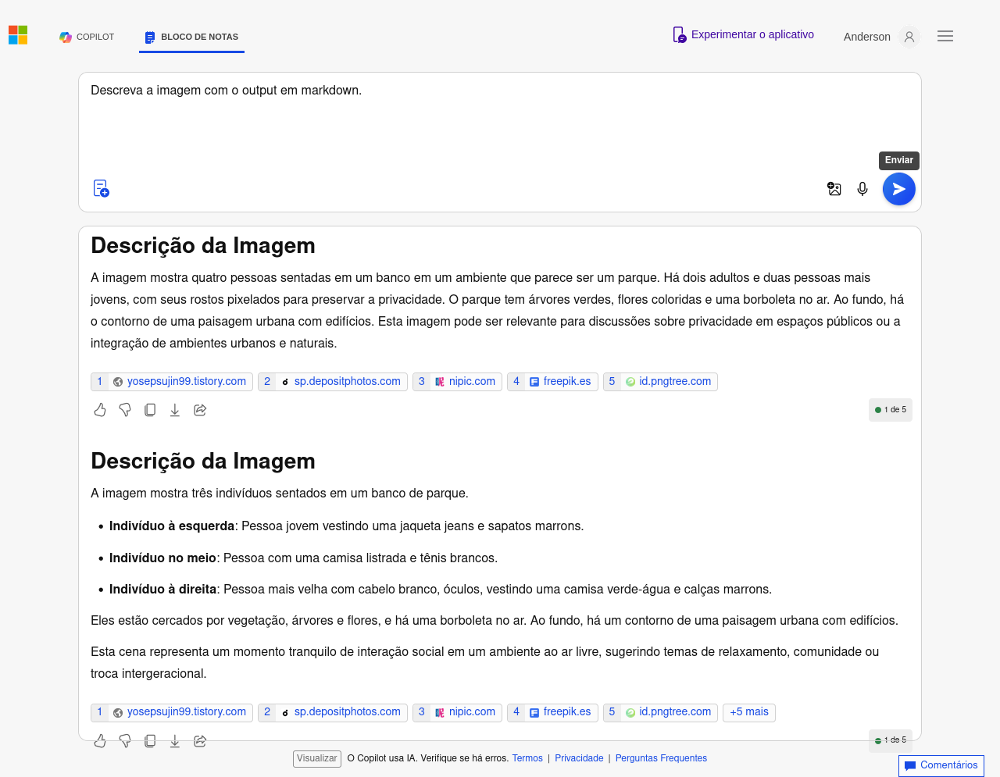

# dio_ia
Explorando os Recursos de IA Generativa com Copilot e OpenAI

## Reconhecimento de Imagem

### Processo
- **Passo 1**: Criação do repositório no GitHub.
- **Passo 2**: Upload das imagens na pasta `inputs`.
- **Passo 3**: Processamento das imagens para reconhecimento de texto.
- **Passo 4**: Salvamento dos resultados na pasta `output`.

## Etapas

### Input
Insira o input com uma imagem e o seguinte prompt: _Descreva a imagem com o output em markdown._

### Output
Acompanhe o output do prompt.

